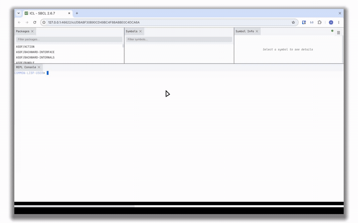

# takesy

[](LICENSE)
[](https://github.com/atgreen/takesy/releases/latest)
[](https://github.com/atgreen/takesy/releases)

> A screen recorder for modern Linux desktops (Wayland & X11).

**takesy** records your screen and turns it into a polished screencast: it
automatically zooms in on wherever you're working, smooths the cursor motion,
and composites the result — padded background, rounded corners, drop shadow —
into a finished mp4. You just record; takesy directs the shot.

<p align="center"></p>

## Features

- **Tracked camera** — a smooth, spring-damped pan and zoom that follows where
  the screen is changing, breathing tighter or wider as activity concentrates.
- **Never crops the action** — watches the screen (frame diffs) and fits the
  zoom to the active region, so relevant changes always stay in frame.
- **Smoothed cursor** — a speed-adaptive spring that aims at your clicks (cutting
  the usual overshoot) yet stays responsive when you point at things.
- **Polished compositing** — the screen inset on a padded background with rounded
  corners (optional) and a soft drop shadow.
- **Custom cursor** — draw your own cursor image instead of the built-in arrow.
- **Click ripples** — expanding rings on click, with a subtle cursor press animation.
- **Trim idle time** — cut dead stretches (no screen change) to tighten long demos.
- **Webcam inset** — record your camera live during capture (`--webcam /dev/video0`
  or `--webcam auto`), or composite a pre-recorded clip, as a picture-in-picture —
  its corner radius sweeps from circle through rounded to square, with configurable
  border width and colour.
- **Webcam framing preview** — whenever you record a live webcam, takesy first
  opens a local web page to pick the input camera and frame yourself (drag to pan,
  scroll to zoom); what you see is what gets recorded.
- **Countdown** — a 3-2-1 (with audible beeps) before recording starts, so you can get ready.
- **Pause / resume** — `kill -USR1 <pid>` toggles capture; paused time is cut, timeline stays gapless.
- **Audio** — optionally record desktop sound, your mic, or both, muxed into the mp4.
- **Capture once, render many** — record once, then re-render with different
  framing, background, or cursor without re-recording.
- **Click to stop** — record for as long as you like; finish with your desktop's
  screencast Stop button. Frames stream to a compressed intermediate during
  capture and straight to the encoder on render, so long recordings stay small
  on disk.
- **One self-contained binary** — builds to a single `takesy` executable.

## Requirements

- A modern Linux desktop (Wayland or X11) with `xdg-desktop-portal` + PipeWire
  (GNOME, KDE, or wlroots)
- `ffmpeg` with an H.264 encoder (`libx264` or `libopenh264`)
- `pactl` (PulseAudio/PipeWire) — only for `--audio`
- [SBCL](https://www.sbcl.org/) and [ocicl](https://github.com/ocicl/ocicl) to
  build (dependencies resolve automatically)

## Install

Prebuilt x86_64 packages are published for each release. The packages are
GPG-signed and pull in `ffmpeg` and the PipeWire/EGL runtime libraries takesy
needs.

### Fedora / RHEL (RPM)

Add the takesy repository and install:

```sh
sudo dnf config-manager addrepo --from-repofile=https://atgreen.github.io/takesy/rpm-repo/takesy.repo
sudo dnf install takesy
```

The signing key is imported automatically by dnf on first install.

### Debian / Ubuntu (DEB)

Add the takesy repository and install:

```sh
curl -fsSL https://atgreen.github.io/takesy/deb-repo/takesy-archive-keyring.gpg | sudo tee /usr/share/keyrings/takesy-archive-keyring.asc > /dev/null
echo "deb [signed-by=/usr/share/keyrings/takesy-archive-keyring.asc] https://atgreen.github.io/takesy/deb-repo stable main" | sudo tee /etc/apt/sources.list.d/takesy.list
sudo apt update
sudo apt install takesy
```

Individual `.rpm` / `.deb` files are also attached to each
[GitHub release](https://github.com/atgreen/takesy/releases/latest).

## Build

```sh
make                # -> ./takesy
make install        # copies takesy to ~/.local/bin
```

## Usage

```sh
takesy                                 # record; click Stop in the top bar to finish
takesy --output talk.mp4 --duration 20
takesy --audio both                    # record desktop sound + mic too
takesy --webcam auto                   # picture-in-picture from your webcam (live)
takesy --cursor arrow.png              # use a custom cursor image
takesy --bg-image wallpaper.png        # put an image behind the inset
takesy --output demo.gif               # straight to an animated GIF (no audio)
takesy help
```

Pick a source in the screen-share dialog, do your thing, then click your
desktop's screencast **Stop** button to finish. The cursor is hidden during
capture — takesy needs its position to drive the auto-zoom — and restored when
you're done. (If you haven't run `make install`, invoke it as `./takesy`.)

### Capture once, render many

The pipeline splits so you can record once and re-render with different framing
as often as you like — no re-recording:

```sh
takesy capture --dir /tmp/talk       # capture only -> self-contained recording dir
takesy render /tmp/talk --output a.mp4 --bg dark
takesy render /tmp/talk --output b.mp4 --bg navy --aspect 9:16   # same capture, new look
```

`capture` writes the frames plus a manifest into the dir; `render` runs the
auto-zoom and compositing over it, honouring all the options below.

| Option | Meaning | Default |
| --- | --- | --- |
| `--output PATH` | output file; a `.gif` path produces an animated GIF (no audio) instead of an mp4 | `/tmp/takesy-record.mp4` |
| `--duration S` | optional maximum length (safety cap); by default there's none — you set the length by clicking Stop | none |
| `--fps N` | output frame rate | `24` |
| `--height N` | maximum output height in px (never upscales past the content) | `1200` |
| `--bg COLOR` | background — `blur` (default; a frosted copy of the screen), or `#RRGGBB` / a name (`black`, `white`, `dark`, `navy`, `slate`, …) for a solid | `blur` |
| `--bg-image PATH` | background image (PNG or anything ffmpeg reads), cover-fit behind the inset; overrides `--bg` | — |
| `--aspect W:H` | reframe the output to an aspect (e.g. `9:16` vertical, `1:1` square); the screen is scaled to fit inside it (letterboxed, never cropped) | content aspect |
| `--region X,Y,W,H` | frame a fixed screen region (source pixels) instead of auto-cropping to content | auto-crop |
| `--trim-idle` | cut idle stretches (no screen change) longer than `--idle-threshold` down to `--max-idle` seconds; tightens long demos (drops audio for now) | off |
| `--ripples on\|off` | expanding ring on each click, with a subtle cursor press animation | `on` |
| `--webcam SRC` | webcam inset: `SRC` = `/dev/videoN` or `auto` records the camera **live** during capture; any other path is a pre-recorded video/image | — |
| `--webcam-corner F` | inset corner radius, fraction of half-size: `1` = circle, `0` = square, between = rounded | `1` |
| `--webcam-border F` | inset border width, fraction of the inset (`0` = none) | `0.012` |
| `--webcam-border-color C` | inset border colour — a name or `#RRGGBB` | `white` |
| `--webcam-pos`, `--webcam-size` | inset corner (`br\|bl\|tr\|tl`) and diameter (fraction of height) | `br`, `0.22` |
| `--webcam-zoom`, `--webcam-pan-x`, `--webcam-pan-y` | webcam framing — normally set in the auto preview, but can be forced | `1`, `0`, `0` |
| `--corner-radius F` | rounded-corner radius (fraction of the content's shorter side); `0` gives square corners | `0.09` |
| `--margin F` | inset margin around the screen, as a fraction of the frame | `0.04` |
| `--cursor PATH` | draw a custom cursor image (PNG or anything ffmpeg reads) instead of the built-in arrow | built-in arrow |
| `--cursor-hotspot X,Y` | the image's click point, as a fraction of its size | `0,0` (top-left) |
| `--cursor-size F` | cursor height as a fraction of the output height | `0.06` |
| `--audio MODE` | record audio: `system` (desktop/monitor), `mic`, or `both` (mixed). Muxed into the mp4 as AAC; set at `capture`/`record` time | off |
| `--audio-offset S` | A/V sync nudge (seconds, signed); `+` pushes audio **later** to fix audio that leads the picture. Auto-aligned by the count-in clapperboard, so normally `0` | `0` |
| `--webcam-offset S` | webcam-PiP sync nudge (seconds, signed); `+` pushes the webcam **later**. Auto-aligned from the capture clock, so normally `0` | `0` |
| `--countdown N` | seconds of 3-2-1 countdown before recording starts; set at `capture`/`record` time | `3` |

### The camera

takesy directs the camera like an editor rather than following the cursor: it
ranks evidence (clicks > sustained activity > cursor), picks shots from a small
vocabulary (overview / working / detail), holds each shot, and moves in single
composed, eased gestures — establishing wide first, widening through the overview
on large jumps, and never darting after a brief flash. There are no per-move
knobs to dial; the direction is automatic. `--log-camera PATH` writes the
per-frame camera path (zoom/pan) to CSV and prints a motion summary if you want
to inspect it.

Cursor feel and how much the camera reacts to the pointer are tunable:

| Option | Meaning | Default |
| --- | --- | --- |
| `--cursor-omega-fast R` | cursor-spring stiffness when the pointer moves fast — higher tracks the real pointer more tightly (less lag) | `60.0` |
| `--cursor-anticipate S` | seconds before a click to start aiming the cursor straight at it | `0.15` |
| `--camera-smoothing S` | smooth hand tremor out of the auto-zoom camera, seconds (`0` = off) | `0.15` |
| `--damage-anchor MODE` | how the camera frames screen activity: `reading` keeps the left column / top context in view; `center` centres on the change | `reading` |

## How it works

1. **Capture** (`takesy capture`) — receives frames and the cursor position over
   `xdg-desktop-portal` + PipeWire, streaming them to a compressed intermediate,
   plus optional audio. Writes a self-contained recording dir.
2. **Direct** — detects where you focused, plans eased auto-zoom keyframes fit to
   the active region, and smooths the cursor path.
3. **Composite** (`takesy render`, GPU) — renders the zoom, background, rounded
   corners, drop shadow, and cursor overlay with EGL/OpenGL, streaming frames
   straight to `ffmpeg` (and muxing audio) — no large scratch files.

`takesy` (or `takesy record`) runs all three in one shot; `capture` and `render`
split them so one recording can be rendered many ways.

## License

Created by [Anthony Green](https://github.com/atgreen); distributed under the
[GNU General Public License v3.0 or later](LICENSE).
